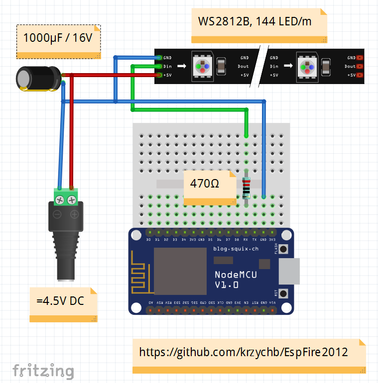

# EspFire2012

Testing of NeoPixel libraries to do Fire2012 animation with ESP8266 using [esp8266/Arduino](https://github.com/esp8266/Arduino).

## Introduction

Since I watched ["Using I2S on the ESP8266 to drive WS2812Bs"](https://www.youtube.com/watch?v=6zqGwxqJQnw) by [CNLohr](https://plus.google.com/+CharlesLohr/posts) (Charles Lohr) I have been looking for an opportunity to build an unconventional project to control [NeoPixels](https://www.adafruit.com/category/168) with ESP8266. 

In April 2016 I have noticed [FastLED](https://github.com/FastLED/FastLED) added to ["Other libraries"](https://github.com/esp8266/Arduino/blob/master/doc/libraries.md#other-libraries-not-included-with-the-ide) of esp8266/Arduino. When checking what it can be used for, I found this nice ["Fire2012: fire simulation for Arduino and LEDs"](https://www.youtube.com/watch?v=_oVVCXOFDkw) by [Mark Kriegsman](https://twitter.com/markkriegsman). I rush looking for the code and got really impressed. The code was small, really well documented and full of options to customize how the fire will look like.

That is how Fire2012 become my first project using NeoPixels.

It turned out that FastLED library has not been working properly for me with Fire2012 and I ended testing other libraries. I  decided to document my findings and that is why I set up this repository.

## Libraries

I have tested the following three libraries listed under ["Other libraries (not included with the IDE)"](https://github.com/esp8266/Arduino/blob/master/doc/libraries.md#other-libraries-not-included-with-the-ide) of esp8266/Arduino:
- [NeoPixel](https://github.com/adafruit/Adafruit_NeoPixel) - Adafruit's NeoPixel library, now with support for the ESP8266 (use version 1.0.2 or higher from Arduino's library manager).
- [NeoPixelBus](https://github.com/Makuna/NeoPixelBus) - Arduino NeoPixel library compatible with ESP8266. Use the "DmaDriven" or "UartDriven" branches for ESP8266. Includes HSL color support and more.
- [FastLED](https://github.com/FastLED/FastLED) - a library for easily & efficiently controlling a wide variety of LED chipsets, like the Neopixel (WS2812B), DotStar, LPD8806 and many more. Includes fading, gradient, color conversion functions.

## Hardware

To do the testing I have collected the following hardware: 
- **Pixel strip** WS2812B, 144 pixels/m. You can use other strips as well - to obtain good results select a strip with minimum 20 pixels and with minimum density of 60 pixels/m
- **ESP8266 module** - NodeMCU 1.0 (ESP-12E Module). I have selected this one to make my prototyping more convenient. It has USB / serial interface and power supply on board so you do not need to provide them separately. You can use any other [typical ESP8266 modules](https://github.com/esp8266/Arduino/blob/master/doc/boards.md) as well. One single pin GPIO3 (TXD0) is used for driving WS2812B.
- **Pixel strip power supply** - Adjustable DC-DC power supply CN4015-3.1 together with AC-DC 12V power supply. You should be able to go away with a "wall wart" 5V DC power supply assuming it will match power consumption of your LED strip. To avoid potential issues with 3.3V logic of ESP8266, use an adjustable power supply and lover output voltage below 5V. For more details please check excellent guide ["Powering NeoPixels"](https://learn.adafruit.com/adafruit-neopixel-uberguide/power) by Adafruit. 
- **1000uF/16V capacitor** to improve quality of power supply to the pixel strip – see [“Best Practices”](https://learn.adafruit.com/adafruit-neopixel-uberguide/basic-connections) by Adafruit.
- **470Ω resistor** to separate ESP8266 and the pixel strip. For more details please check [“Best Practices”](https://learn.adafruit.com/adafruit-neopixel-uberguide/basic-connections) by Adafruit.
- **Bread board and cables** - see also ["Basic Connections"](https://learn.adafruit.com/adafruit-neopixel-uberguide/basic-connections) by Adafruit. 

## Schematic

TBA

## Software

I have used the latest software versions available by the time of testing as follows:

- [esp8266/Arduino](https://github.com/esp8266/Arduino) platform core version [2.2.0](https://github.com/esp8266/Arduino/releases/tag/2.2.0)
- [adafruit/Adafruit_NeoPixel](https://github.com/adafruit/Adafruit_NeoPixel) version [1.0.5](https://github.com/adafruit/Adafruit_NeoPixel/releases/tag/v1.0.5)
- [Makuna/NeoPixelBus](https://github.com/Makuna/NeoPixelBus) version [2.1.2](https://github.com/Makuna/NeoPixelBus/releases/tag/2.1.2)
- [FastLED/FastLED](https://github.com/FastLED/FastLED) version [3.1.1](https://github.com/FastLED/FastLED/commit/a5e92af84d6e1d37bee2b352bda5f56c4567ebd6) as discussed in [issue #289](https://github.com/FastLED/FastLED/issues/289)
- [Arduino IDE](https://www.arduino.cc/) version [1.6.9](https://www.arduino.cc/en/Main/Software)

The ESP8266 platform package and libraries ware installed from Arduino IDE except FastLED library that was installed from GitHub (ref [#289](https://github.com/FastLED/FastLED/issues/289)).

## Fire2012 Application

TBA

## EspFire2012 Application

TBA

## Testing

### Performance

Comparison of Libraries – https://youtu.be/mUFssLiALFk 

TBA

### Functionality

- Brightness Control –  https://youtu.be/ymsCrwRauSY 
- Cooling Control – https://youtu.be/tdtMMqTBR4E 
- Sparking Control – https://youtu.be/Tq5M-ZS9FgY

TBA

## Credits

TBA

## Contribute

Feel free to contribute to the project in any way you like!

If you find any issues with code or descriptions please report them using [Issues](https://github.com/krzychb/EspFire2012/issues) tab above.
