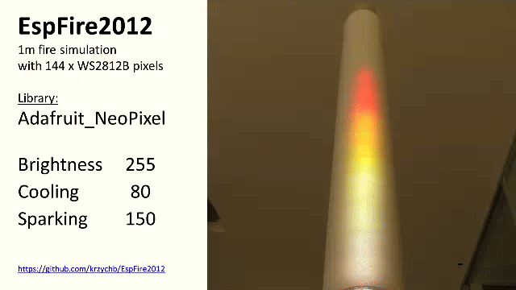
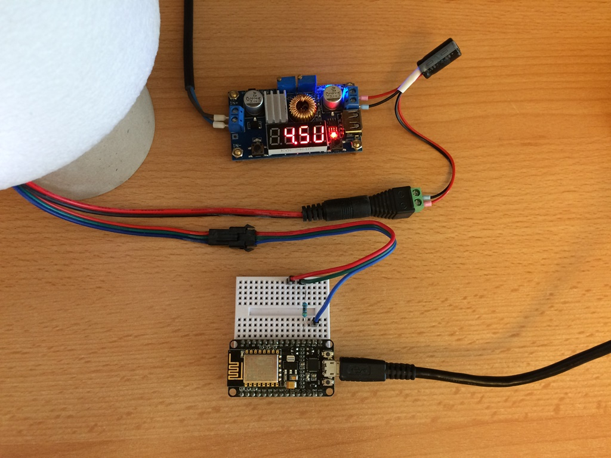
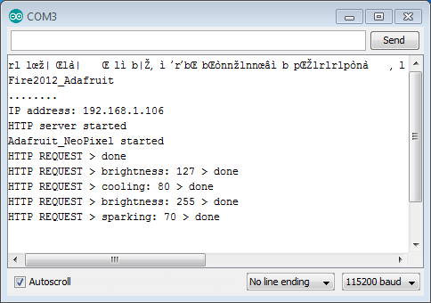
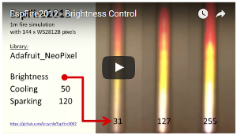
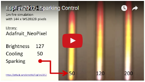
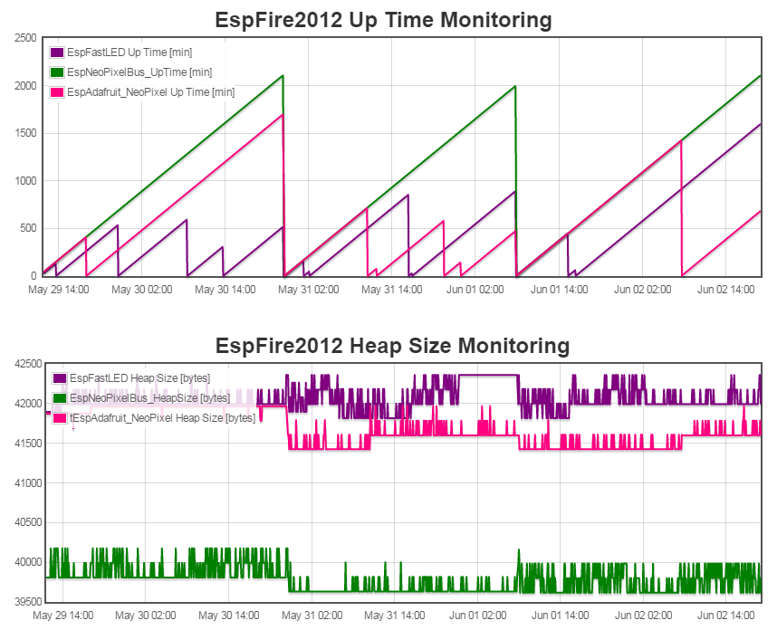
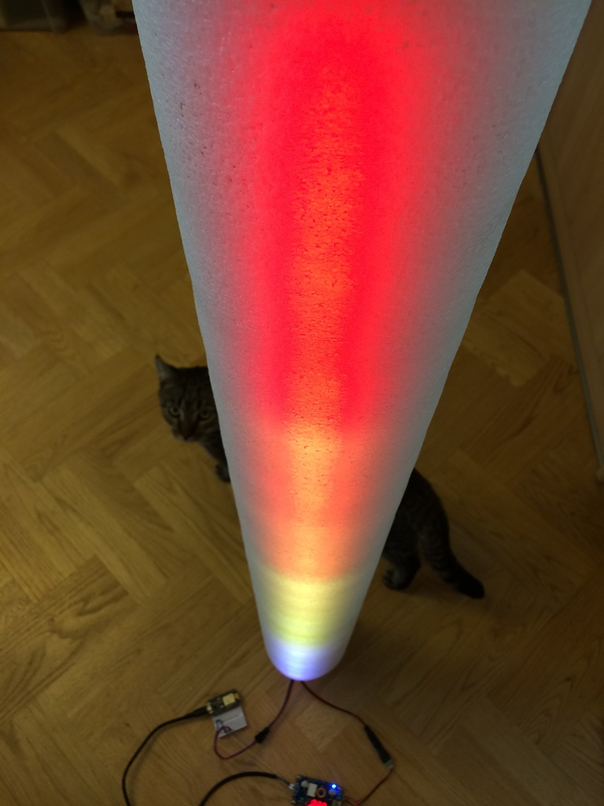

# EspFire2012 [](https://travis-ci.org/krzychb/EspFire2012)

Testing of NeoPixel libraries to do fire simulation with Fire2012 and ESP8266 using [esp8266/Arduino](https://github.com/esp8266/Arduino)

 


## Introduction

Since I watched ["Using I2S on the ESP8266 to drive WS2812Bs"](https://www.youtube.com/watch?v=6zqGwxqJQnw) by [CNLohr](https://plus.google.com/+CharlesLohr/posts) (Charles Lohr) I have been looking for an opportunity to build an unconventional project to control [NeoPixels](https://www.adafruit.com/category/168) with ESP8266.

In April 2016 I have noticed [FastLED](https://github.com/FastLED/FastLED) added to ["Other libraries"](https://github.com/esp8266/Arduino/blob/master/doc/libraries.md#other-libraries-not-included-with-the-ide) of esp8266/Arduino. When checking what it can be used for, I found nice and realistic ["Fire2012: fire simulation for Arduino and LEDs"](https://www.youtube.com/watch?v=_oVVCXOFDkw) by [Mark Kriegsman](https://twitter.com/markkriegsman). I rush looking for the code and got really impressed. The [code](https://github.com/FastLED/FastLED/tree/master/examples/Fire2012/Fire2012.ino) was small, really well documented and contained couple of options to customize how the fire simulation will look like.

That is how Fire2012 became my first project using NeoPixels.

Initially FastLED library has not been working properly for me with Fire2012 and I ended up testing other libraries. I decided to document my findings and that is why I set up this repository.


## Table of Contents
- [Introduction](#introduction)
- [Requirements](#requirements)
- [Components](#components)
  - [Fire2012](#fire2012)
  - [Hardware](#hardware)
  - [Libraries](#libraries)
  - [Software](#software)
- [EspFire2012](#espfire2012-1)
  - [EspAdafruit_NeoPixel](#espadafruit_neopixel)
  - [EspNeoPixelBus](#espneopixelbus)
  - [EspFastLED](#espfastled)
- [Usage](#usage)
- [Testing](#testing)
  - [EspAdafruit_NeoPixel](#espadafruit_neopixel-1)
  - [EspNeoPixelBus](#espneopixelbus-1)
  - [EspFastLED](#espfastled-1)
  - [Stability](#stability)
- [Credits](#credits)
- [Contribute](#contribute)
- [Summary](#summary)
- [Conclusion](#conclusion)


## Requirements

This project is to implement [Fire2012](https://blog.kriegsman.org/2014/04/04/fire2012-an-open-source-fire-simulation-for-arduino-and-leds/) application on [ESP8266](https://en.wikipedia.org/wiki/ESP8266) with on-line set up of fire simulation parameters that meets the following requirements:

* Implementation with WS2812B strip with 144 LEDs
* Simulation at 60 frames/s
* Accurate reproduction of fire colors
* On-line set up of brightness, sparking and cooling
* Implementation with Arduino IDE
* Up time monitoring on Emoncms.org
* Stable operation
* Over the Air (OTA) application updates


## Components

Software and hardware components that have been used to build this project.


### Fire2012

The code of fire simulation has been released by Mark Kriegsman in his blog https://blog.kriegsman.org. It fascinated me with it's simplicity - the simulation itself is only [about 25 or 30 lines of code](https://blog.kriegsman.org/2014/04/04/fire2012-an-open-source-fire-simulation-for-arduino-and-leds/). For more information please refer to the [source code](https://github.com/FastLED/FastLED/tree/master/examples/Fire2012/Fire2012.ino) of this application - it contains very detailed in-line comments explaining all and every step of simulation.

There are two parameters to control fire simulation:

**Cooling** - how much does the air cool as it rises?
- Less cooling = taller flames
- More cooling = shorter flames

**Sparking** - what chance is there that a new spark will be lit?
- Higher chance = more roaring fire
- Lower chance = more flickery fire

There is also **Brightness** not directly used in simulation.

All above parameters are hard coded in Fire2012. I have decided to provide a simple web interface to set them up on-line and see instantly how they affect simulation.


Setting up such interface should be an easy task with [ESP8266](http://www.esp8266.com/) module!


### Hardware

To do the testing I have collected the following hardware:
- **Pixel strip** WS2812B, 144 pixels/m. You can use other strips as well - to obtain good results select a strip with minimum 20 pixels and with minimum density of 60 pixels/m,
- **ESP8266 module** - NodeMCU 1.0 (ESP-12E Module). I have selected this one to make my prototyping more convenient. It has USB / serial interface and power supply on board, so you do not need to provide them separately. You can use any other [typical ESP8266 modules](https://github.com/esp8266/Arduino/blob/master/doc/boards.md#table-of-contents) as well. One single pin GPIO3 (TXD0) is used for driving WS2812B and make sure it is broken out in your module.
- **Pixel strip power supply** - Adjustable DC-DC power supply CN4015-3.1 together with AC-DC 12V power supply. You should be able to go away with a "wall wart" 5V DC power supply assuming it will match power consumption of your LED strip. To avoid potential issues with 3.3V logic of ESP8266, use an adjustable power supply and lover output voltage below 5V. For more details please check excellent guide ["Powering NeoPixels"](https://learn.adafruit.com/adafruit-neopixel-uberguide/power) by Adafruit.
- **1000uF/16V capacitor** to improve quality of power supply to the pixel strip - see ["Best Practices"](https://learn.adafruit.com/adafruit-neopixel-uberguide/basic-connections) by Adafruit.
- **470 ohm resistor** to separate ESP8266 and the pixel strip. For more details please check ["Best Practices"](https://learn.adafruit.com/adafruit-neopixel-uberguide/basic-connections) by Adafruit.
- **Bread board and cables** - see also ["Basic Connections"](https://learn.adafruit.com/adafruit-neopixel-uberguide/basic-connections) by Adafruit.




Schematic of connections in Fritzing format is available [here](pictures/EspNeoPixelConnection.fzz).


### Libraries

I have tested the following three libraries listed under ["Other libraries (not included with the IDE)"](https://github.com/esp8266/Arduino/blob/master/doc/libraries.md#other-libraries-not-included-with-the-ide) of esp8266/Arduino:
- [NeoPixel](https://github.com/adafruit/Adafruit_NeoPixel) - Adafruit's NeoPixel library, now with support for the ESP8266 (use version 1.0.2 or higher from Arduino's library manager).
- [NeoPixelBus](https://github.com/Makuna/NeoPixelBus) - Arduino NeoPixel library compatible with ESP8266. Use the "DmaDriven" or "UartDriven" branches for ESP8266. Includes HSL color support and more.
- [FastLED](https://github.com/FastLED/FastLED) - a library for easily & efficiently controlling a wide variety of LED chipsets, like the Neopixel (WS2812B), DotStar, LPD8806 and many more. Includes fading, gradient, color conversion functions.


### Software

I have used the latest software versions available by the time of testing as follows:

- [esp8266/Arduino](https://github.com/esp8266/Arduino) platform core version [2.2.0](https://github.com/esp8266/Arduino/releases/tag/2.2.0)
- [adafruit/Adafruit_NeoPixel](https://github.com/adafruit/Adafruit_NeoPixel) version [1.0.5](https://github.com/adafruit/Adafruit_NeoPixel/releases/tag/v1.0.5)
- [Makuna/NeoPixelBus](https://github.com/Makuna/NeoPixelBus) version [2.1.2](https://github.com/Makuna/NeoPixelBus/releases/tag/2.1.2)
- [FastLED/FastLED](https://github.com/FastLED/FastLED) version [3.1.1](https://github.com/FastLED/FastLED/commit/1b546b31896dd2c4d95c16bb17c852b3d8177eb1) saved directly from GitHub repository

The ESP8266 platform package and libraries ware installed from Arduino IDE except FastLED library that was installed from GitHub (ref [#289](https://github.com/FastLED/FastLED/issues/289) and [#306](https://github.com/FastLED/FastLED/issues/306#issuecomment-220103390)).


## EspFire2012

Application prepared for ESP8266 consists of the following files:

1. [Fire.ino](EspFastLED/Fire.ino) together with [Fire.h](EspFastLED/Fire.h) - fire simulation code that primarily contains original Fire2012 application.
2. [WebInterface.ino](EspFastLED/WebInterface.ino) together with [WebInterface.h](EspFastLED/WebInterface.h) - web interface shown on the [picture above](#fire2012) and Wi-Fi set up routines.
3. [Emoncms.ino](EspFastLED/Emoncms.ino) together with [Emoncms.h](EspFastLED/Emoncms.h) - routines to post data on [Emoncms.org](Emoncms.org) to monitor application up time, heap size and other parametrs if required. You need to set up an account on Emoncms.org to use it. This is quick and simple - please refer to my [OnlineHumidifier](https://github.com/krzychb/OnlineHumidifier/tree/master/6-Chart#emoncms) repository that explains how to do it.
4. [EspFastLED.ino](EspFastLED/EspFastLED.ino) - a simple main sketch that integrates the above *Fire*, *WebInterface* and *Emoncms*.


EspFire2012 application has been tested with three previously described libraries for NeoPixel control. Respective application versions are available for your review in the following folders:

- [EspAdafruit_NeoPixel](EspAdafruit_NeoPixel)
- [EspNeoPixelBus](EspNeoPixelBus)
- [EspFastLED](EspFastLED)

Within each application version the main sketch contains identical code:

In ``` setup() ``` the following functions are called once on module start up:

```
  setupWiFi(); // set up Wi-Fi to access web interface
  setupWebServer(); // set up web interface
  setupFire();  // set up library to operate NeoPixel strip and Fire2013 application
```

In ``` loop() ``` the following two functions are repeatedly called:

```
  server.handleClient();  // respond to commands from web browser
  logToEmoncms();  // Log aplication performance data to Emoncms.org
  keepFireAlive();  // simulate Fire2012
```
The main sketch file names have been changed to distinguish tested libraries.

The only important differences between application versions concern ``` Fire.ino ``` and ``` Fire.h ``` files. This is to accommodate calls to particular NeoPixel libraries. Details are described in separate chapters below and the rest of code in these files is identical for each version.

I will skip description of code to establish Wi-Fi access and setting up a web server. This code is very basic and identical for all versions of application. If you are new to EP8266 please check my other repository [OnlineHumidifier](https://github.com/krzychb/OnlineHumidifier) that will walk you through ESP8266 basics.


### EspAdafruit_NeoPixel

The lines specific to this library are contained in files [Fire.ino](EspAdafruit_NeoPixel/Fire.ino) and  [Fire.h](EspAdafruit_NeoPixel/Fire.h).

1. Include required in header file [Fire.h](EspAdafruit_NeoPixel/Fire.h):
  ```
  #include <Adafruit_NeoPixel.h>
  ```

2. Declaration before NeoPixel strip initialization in [Fire.ino](EspAdafruit_NeoPixel/Fire.ino):
  ```
  Adafruit_NeoPixel pixels = Adafruit_NeoPixel(NUM_LEDS, LED_PIN, NEO_GRB + NEO_KHZ800);
  ```

3. Initialization of NeoPixel strip in function ``` setupFire() ``` :
  ```
    pixels.begin();
  ```

4. Animation of NeoPixel strip in function ``` keepFireAlive() ``` :
  ```
    for (int i = 0; i < NUM_LEDS; i++)
    {
      pixels.setPixelColor(i, pixels.Color(leds[i].r, leds[i].g, leds[i].b));
    }
    pixels.setBrightness(brightness);
    pixels.show();
  ```

Complete code for this version of application is saved under [EspAdafruit_NeoPixel](EspAdafruit_NeoPixel).


### EspNeoPixelBus

The lines specific to this library are contained in files [Fire.ino](EspNeoPixelBus/Fire.ino) and  [Fire.h](EspNeoPixelBus/Fire.h).

1. Include required in header file [Fire.h](EspNeoPixelBus/Fire.h):
  ```
  #include <NeoPixelBus.h>
  ```

2. Declaration before NeoPixel strip initialization in [Fire.ino](EspNeoPixelBus/Fire.ino):
  ```
  NeoPixelBus<NeoGrbFeature, Neo800KbpsMethod> strip(NUM_LEDS, LED_PIN);
  ```

3. Initialization of NeoPixel strip in function ``` setupFire() ``` :
  ```
    strip.Begin();
    strip.Show();
  ```

4. Animation of NeoPixel strip in function ``` keepFireAlive() ``` :
  ```
    RgbColor pixel;
    for(int i=0; i<NUM_LEDS; i++)
    {
      pixel = RgbColor(leds[i].r, leds[i].g, leds[i].b);
      pixel.Darken(255-brightness);
      strip.SetPixelColor(i, pixel);
    }
    strip.Show();
  ```
Complete code for this version of application is saved under [EspNeoPixelBus](EspNeoPixelBus).


### EspFastLED

The lines specific to this library are contained in files [Fire.ino](EspFastLED/Fire.ino) and [Fire.h](EspFastLED/Fire.h).

1. Defines and include required in header file [Fire.h](EspFastLED/Fire.h):
  ```
  #define FASTLED_ESP8266_RAW_PIN_ORDER
  #define FASTLED_ALLOW_INTERRUPTS 0
  ```

2. Defines required before NeoPixel strip initialization in [Fire.ino](EspFastLED/Fire.ino):
  ```
  #define COLOR_ORDER GRB
  #define CHIPSET     WS2812B
  ```

3. Initialization of NeoPixel strip in function ``` setupFire() ``` :
  ```
    FastLED.addLeds<CHIPSET, LED_PIN, COLOR_ORDER>(leds, NUM_LEDS).setCorrection(TypicalLEDStrip);
  ```

4. Animation of NeoPixel strip in function ``` keepFireAlive() ``` :
  ```
    FastLED.setBrightness(brightness);
    FastLED.show();
  ```
Complete code for this version of application is saved under [EspFastLED](EspFastLED).


## Usage

Once you load the code to ESP8266, the application will report back on serial port as below:



After entering displayed IP address in a web browser it should reveal the following web interface:


Change of cooling, sparking or brightness should be immediately visible on the strip. How it looks in practice please check the following short (1 min 21 sec) videos:

| Brightness | Cooling | Sparking |
| --- | --- | --- |
| [](https://youtu.be/ymsCrwRauSY) | [](https://youtu.be/tdtMMqTBR4E) | [](https://youtu.be/Tq5M-ZS9FgY) |
| https://youtu.be/ymsCrwRauSY | https://youtu.be/tdtMMqTBR4E  | https://youtu.be/Tq5M-ZS9FgY |


## Testing

Each version of described above code has been loaded to ESP8266 module and tested. Results are documented in short (1 min 21 sec) video ["Comparison of Libraries"](https://youtu.be/mUFssLiALFk).

[](https://youtu.be/mUFssLiALFk)

On left of video you can see selected fire simulation parameters, on right at the bottom - name of library. Particular comments are provided below.

Apart from functionality I have also compared size of flash and RAM code used by each version of application as provided by Arduino IDE.

| Bytes Used | EspAdafruit_NeoPixel | EspNeoPixelBus | EspFastLED |
| --- | --- | --- | --- |
| Flash | 242,741 | 243,193 | 243,601 |
| RAM | 36,520 | 36,584 | 36,600 |

Results are in very similar range, but frankly saying I was expecting EspFastLED application to use the least Flash and RAM.


### EspAdafruit_NeoPixel

This library worked for me out of the box.

It is worth mentioning that Adafruit has excellent and likely the most extensive [NeoPixel Uberguide](https://learn.adafruit.com/adafruit-neopixel-uberguide). It covers form factors, characteristics and selection of strip to meet your needs. It also provides detailed hardware and software guidelines on connecting and using the strips.

I believe this library is the easiest to start playing with NeoPixels.


### EspNeoPixelBus

Library by Makuna (Michael Miller) also worked for me out of the box.

I have observed different handling of brightness control comparing to the other two libraries. For low brightness values the color spectrum looked like shifted to yellow and red colors - white sparks were not visible at all.

Adarfuit credited Michael Miller for ESP8266 work for the NeoPixelBus library in their [esp8266.c](https://github.com/adafruit/Adafruit_NeoPixel/blob/master/esp8266.c) file that is part of Adafruit_NeoPixel library.


### EspFastLED

With first implementation of this library I have observed [flicker](https://youtu.be/mUFssLiALFk) towards end (top on the [video](https://youtu.be/mUFssLiALFk)) of the NeoPixel strip. This has been clarified by Daniel Garcia in reply to issue report [#306]( https://github.com/FastLED/FastLED/issues/306#issuecomment-219868579).

The issue turned out to be very simple to resolve. Before ``` #include <FastLED.h> ``` the code should contain:
```
#define FASTLED_ALLOW_INTERRUPTS 0
```
Otherwise data transmission to the strip may be broken on random basis by interrupts. This depends on how many LEDs the NeoPixel strip has.

This library attracted me with detailed [documentation](https://github.com/FastLED/FastLED/wiki/Overview), active [community](https://plus.google.com/communities/109127054924227823508) on Google+, several [code examples](https://github.com/FastLED/FastLED/tree/master/examples) and [demos/effects](https://gist.github.com/kriegsman).


### Stability

As [suggested by @TheAustrian](https://github.com/FastLED/FastLED/issues/306#issuecomment-222321712) I let the applications running for a longer time and noticed unexpected self-resets. 

To identify the root cause of this issue, I have loaded each application version on a separate ESP module, added routines to post ``` Up Time ``` and free ``` Heap Size ``` on [Emoncms.org](https://emoncms.org/dashboard/view?id=29419) and started checking the [plots](https://emoncms.org/dashboard/view?id=29419).

The cause of resets may be s/w, h/w or both. To eliminate h/w as the source of issue, I decided to move the s/w around using the same three modules in sequence below.

| EspFire2012 Application | Test 1 | Test 2 | Test 3 |
| --- | --- | --- | --- |
| [EspFastLED](EspFastLED) | ESP A | ESP C | ESP B |
| [EspNeoPixelBus](EspNeoPixelBus) | ESP B | ESP A | ESP C |
| [EspAdafruit_NeoPixel](EspAdafruit_NeoPixel) | ESP C | ESP B | ESP A |

Test started on 29-May-2015 at about 11:20 CET and ended on 2-Jun-2016 at 19:00 CET. Module changes were done on 30-May at 22.50 CET and on 1-Jun at 8:00 CET. Result is shown below:



During test period I have recorded the following number of resets:

| EspFire 2012 Application | Number of Self Resets |
| --- | --- |
| [EspFastLED](EspFastLED) | 10 |
| [EspNeoPixelBus](EspNeoPixelBus) | 0 |
| [EspAdafruit_NeoPixel](EspAdafruit_NeoPixel) | 6 |

Each version of application was running on each one of the three ESP modules. There were no any self-resets of [EspNeoPixelBus](EspNeoPixelBus). Therefore with pretty high certainty I can eliminate h/w as the potential source of issues.

The next step is to troubleshoot the s/w.


## Credits

Software for this project has been prepared thanks to great work of the following teams and individuals:

* [Mark Kriegsman](https://twitter.com/markkriegsman) who developed slick [Fire2012](https://github.com/FastLED/FastLED/tree/master/examples/Fire2012/Fire2012.ino) application that motivated to check out NeoPixels with ESP8266 and prepare this repository
* [Adafruit](https://www.adafruit.com/) providing [Adafruit_NeoPixel](https://github.com/adafruit/Adafruit_NeoPixel) that is only one of numerous examples of open software Adafruit contributed to community
* [Michael Miller](https://github.com/Makuna) that brought [NeoPixelBus](https://github.com/Makuna/NeoPixelBus) implementation for ESP8266 to the masses.
* [Daniel Garcia](https://github.com/focalintent) supported by [Mark Kriegsman](https://twitter.com/markkriegsman) that developed [FastLED](https://github.com/FastLED/FastLED) library
* esp8266/Arduino team lead by [Ivan Grokhotkov](https://twitter.com/i_grr) that brought to us great [ESP8266 core for Arduino](https://github.com/esp8266/Arduino)
* Arduino team that develops and maintains versatile [Arduino IDE](https://www.arduino.cc/)
* [Friends-of-Fritzing](http://friends.fritzing.org/) foundation - developer of widely used, nice and friendly [Fritzing](http://fritzing.org/home/)


## Contribute

Feel free to contribute to the project in any way you like!

If you find any issues with code or descriptions please report them using [Issues](https://github.com/krzychb/EspFire2012/issues) tab above.


## Summary

This project is well advanced with the following results for each version of application so far. Results are updated as the project is progressing.

| Application / Requirements | [EspAdafruit_NeoPixel](EspAdafruit_NeoPixel) | [EspNeoPixelBus](EspNeoPixelBus) | [EspFastLED](EspFastLED) |
| --- | --- | --- | --- |
| Implementation with WS2812B strip with 144 LEDs |  |  |  |
| Simulation at 60 frames/s |  |  |  |
| Accurate reproduction of fire colors |  | issues at low brightness |  |
| On-line set up of brightness, sparking and cooling |   |   |   |
| Implementation with Arduino IDE |   |   |   |
| Up time monitoring on Emoncms.org |   |   |   |
| Stable operation | about 2 self-resets per 24h |   | about 3 self-resets per 24h |
| Over the Air (OTA) application updates | TBD | TBD | TBD |


## Conclusion

When approaching this testing I was skeptical regarding performance of libraries like EspAdafruit_NeoPixel or FastLED. After all they have been prepared for other Arduino boards well before ESP8266 was even available.

I was happy to conclude that all libraries did it guile well. Simulation worked smoothly without any jams, no matter how often I have been accessing web page to update parameters.

Currently I am [investigating an issue with self resets](https://github.com/FastLED/FastLED/issues/306#issuecomment-222321712) of [EspFastLED](EspFastLED) and [EspAdafruit_NeoPixel](EspAdafruit_NeoPixel) applications. Note [issue with colors](#espneopixelbus-1) I had when setting low brightness for EspNeoPixelBus library.

If you found this review interesting then stay tuned. I will provide an update on results of issue troubleshooting.


